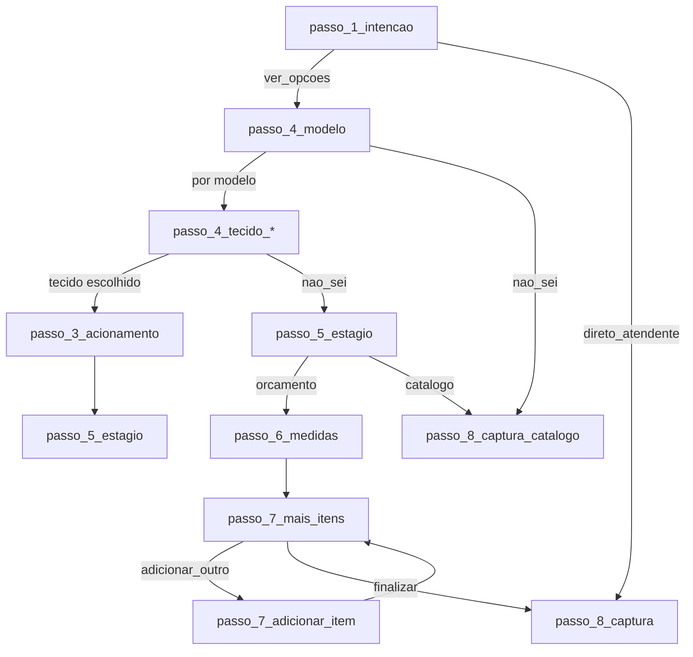

# Quiz V1 — Matriz de etapas e fluxo

Documento de referência para análise e correção do fluxo do Quiz V1.

---

## Ponto de partida

- **Etapa inicial:** `passo_1_intencao`
- **Rota:** `/quiz/v1`
- **Webhook (envio final):** `https://fluxo-n8n.axmxa0.easypanel.host/webhook/quizv1`

---

## Formulários (form_id)

**Total: 5 formulários.** O `form_id` é enviado no payload do webhook e usado em tracking (DataLayer, Pixel).

| ID | Quando é usado |
|----|----------------|
| **quizv1** | Valor inicial do quiz |
| **FORMR5** | Catálogo — usuário escolheu "Não sei" antes do estágio ou não tem medidas |
| **FORMR10** | Já sabe o que quer e quer falar direto com atendente (passo_1_intencao → direto_atendente) |
| **FORMR20** | Uma persiana com medidas (pré-orçamento) |
| **FORMR30** | Mais de uma persiana com medidas (adicionou item extra) |

---

## Diagrama resumido do fluxo

---

## Regra especial (código)

- Em qualquer etapa **antes** de `passo_5_estagio`, se o usuário escolher **"Não sei — Quero recomendação"** (`nao_sei`):
  - O fluxo vai direto para **`passo_8_captura_catalogo`**
  - `formId` é definido como `FORMR5`

---

## Lista de etapas (em ordem de aparição no array)

### Fase 1 — Intenção

| ID | Pergunta | Opções | Próximo passo |
|----|----------|--------|----------------|
| **passo_1_intencao** | Você já sabe exatamente o que precisa ou gostaria de ver as opções disponíveis? | Quero ver as opções → **passo_4_modelo** / Já sei e quero falar com atendente → **passo_8_captura** | passo_4_modelo ou passo_8_captura |

---

### Fase 3 — Acionamento

| ID | Pergunta | Opções | Próximo passo |
|----|----------|--------|----------------|
| **passo_3_acionamento** | Você gostaria dessa persiana manual ou automática? | Manual / Motorizada / Ainda não sei → **passo_5_estagio** (todas) | passo_5_estagio |

---

### Fase 4 — Modelo

| ID | Pergunta | Opções | Próximo passo |
|----|----------|--------|----------------|
| **passo_4_modelo** | Perfeito, então vamos começar pela **Primeira Peça.** Qual modelo você prefere? | Rolô → passo_4_tecido_rolo / Romana → passo_4_tecido_romana / Double Vision → passo_4_tecido_double / Vertical → passo_4_tecido_vertical / Madeira → passo_4_tecido_madeira / Alumínio → passo_4_tecido_aluminio / Teto → passo_4_modelo_teto / Painel → passo_4_tecido_painel / Cortina → passo_4_tecido_cortina / **Não sei** → **passo_8_captura_catalogo** | conforme opção |

---

### Fase 4.1 a 4.9 — Tecidos (por modelo)

| ID | Pergunta | Próximo passo (opção típica) | Exceções |
|----|----------|------------------------------|----------|
| **passo_4_tecido_rolo** | Escolha o tecido para sua Persiana Rolô | passo_3_acionamento | "Não sei" → passo_5_estagio |
| **passo_4_tecido_romana** | Escolha o tecido para sua Persiana Romana | passo_3_acionamento | "Não sei" → passo_5_estagio |
| **passo_4_tecido_double** | Escolha o tecido para sua Double Vision | passo_3_acionamento | "Não sei" → passo_5_estagio |
| **passo_4_tecido_vertical** | Escolha o tecido para sua Persiana Vertical | passo_5_estagio | (todas vão para passo_5) |
| **passo_4_tecido_madeira** | Escolha o acabamento para sua Persiana de Madeira | passo_3_acionamento | "Não sei" → passo_5_estagio |
| **passo_4_tecido_aluminio** | Escolha o acabamento para sua Persiana de Alumínio | passo_3_acionamento | "Não sei" → passo_5_estagio |
| **passo_4_modelo_teto** | Qual modelo de Persiana de Teto você prefere? | Romana → passo_4_tecido_teto_romana / Celular → passo_4_tecido_teto_celular / Plissada → passo_4_tecido_teto_plissada | "Não sei" → passo_5_estagio |
| **passo_4_tecido_teto_romana** | Escolha o tecido para sua Romana de Teto | passo_3_acionamento | "Não sei" → passo_5_estagio |
| **passo_4_tecido_teto_celular** | Escolha o tecido para sua Celular de Teto | passo_5_estagio | — |
| **passo_4_tecido_teto_plissada** | Escolha o tecido para sua Plissada de Teto | passo_5_estagio | — |
| **passo_4_tecido_painel** | Escolha o tecido para sua Persiana Painel | passo_5_estagio | "Não sei" → passo_5_estagio |
| **passo_4_tecido_cortina** | Escolha o tecido para sua Cortina | passo_4_acabamento_cortina (ou "Não sei" → passo_5_estagio) | — |
| **passo_4_acabamento_cortina** | Escolha o acabamento para sua Cortina | passo_3_acionamento | "Não sei" → passo_5_estagio |

---

### Fase 5 — Estágio

| ID | Pergunta | Opções | Próximo passo |
|----|----------|--------|----------------|
| **passo_5_estagio** | Em que fase você está agora? | Já tenho medidas e quero pré-orçamento → **passo_6_medidas** / Não tenho medidas e quero pré-orçamento → **passo_8_captura_catalogo** | passo_6_medidas ou passo_8_captura_catalogo |

---

### Fase 6 — Medidas

| ID | Pergunta | Tipo | Próximo passo |
|----|----------|------|----------------|
| **passo_6_medidas** | Perfeito! Envie as medidas necessárias | medidas (largura, altura em cm) | passo_7_mais_itens |

---

### Fase 7 — Mais itens / Adicionar item

| ID | Pergunta | Opções / Ação | Próximo passo |
|----|----------|----------------|----------------|
| **passo_7_mais_itens** | Pode escolher uma nova persiana/cortina ou prosseguir | Adicionar novo item → **passo_7_adicionar_item** / Seguir somente com este orçamento → **passo_8_captura** | passo_7_adicionar_item ou passo_8_captura |
| **passo_7_adicionar_item** | Informe sobre as próximas persianas e cortinas que deseja | textarea (descrição livre) | passo_7_mais_itens |

---

### Fase 8 — Captura (final)

| ID | Pergunta | Tipo | Observação |
|----|----------|------|------------|
| **passo_8_captura** | Perfeito! Para te enviar este pré orçamento | mixed: nome, whatsapp, email, cidade, bairro, ambientes (multi-select) | isFinal: true |
| **passo_8_captura_catalogo** | Receber Catálogo — Preencha para receber o catálogo | mixed: nome, whatsapp, ambientes | isFinal: true; menos campos que passo_8_captura |

---

## Resumo dos destinos finais

- **passo_8_captura** — Pré-orçamento com medidas (fluxo completo).
- **passo_8_captura_catalogo** — Catálogo / quem não tem medidas ou escolheu "Não sei" antes do estágio.

---

## Arquivos de definição

- Steps: `src/v1/steps.js`
- Lógica de navegação e regras (ex.: `nao_sei` → catálogo): `src/v1/QuizV1.jsx`
