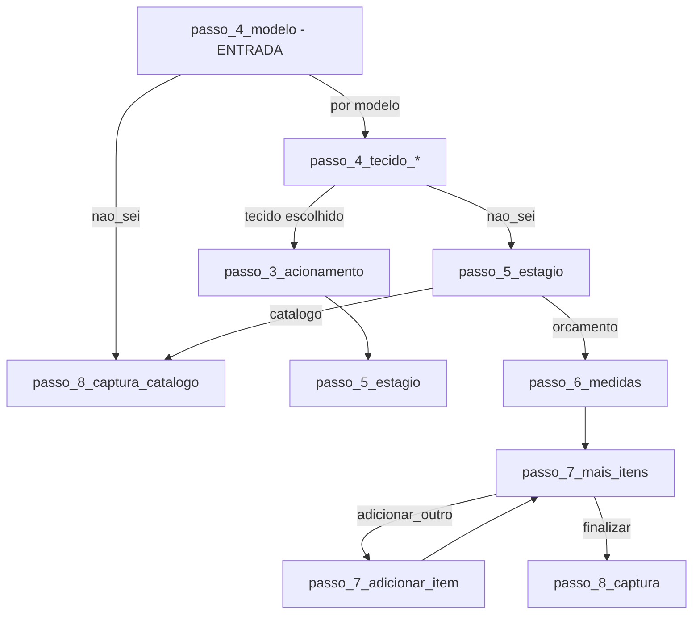

# Quiz V2 — Matriz de etapas e fluxo

Documento de referência para análise e correção do fluxo do Quiz V2.

---

## Ponto de partida

- **Etapa inicial:** `passo_4_modelo` (quiz **não** exibe `passo_1_intencao`; começa direto na escolha do modelo)
- **Rota:** `/quiz/v2`
- **Webhook (envio final):** `https://fluxo-n8n.axmxa0.easypanel.host/webhook/quizv2`
- **A/B:** usa `src/v2/ab_test.js` (variante pode afetar comportamento; steps são os mesmos do array)

---

## Formulários (form_id)

**Total: 2 formulários.** O `form_id` é enviado no payload do webhook e usado em tracking (DataLayer, Pixel).

| ID | Quando é usado |
|----|----------------|
| **FORMR20** | Uma persiana com medidas (pré-orçamento) |
| **FORMR30** | Mais de uma persiana com medidas (adicionou item extra) |

---

## Diferença em relação ao V1

| Aspecto | V1 | V2 |
|---------|----|----|
| Primeira tela | passo_1_intencao (intenção) | passo_4_modelo (modelo) |
| passo_1_intencao no steps | Sim — "ver opções" → passo_4_modelo | Existe no array; "ver opções" → passo_3_acionamento (não usado como entrada) |
| Texto passo_4_modelo | "Perfeito, então vamos começar pela **Primeira Peça.** Qual modelo você prefere?" | "Qual modelo você prefere?" (mais curto) |

---

## Diagrama resumido do fluxo

---

## Regra especial (código)

- Em qualquer etapa **antes** de `passo_5_estagio`, se o usuário escolher **"Não sei — Quero recomendação"** (`nao_sei`):
  - O fluxo vai direto para **`passo_8_captura_catalogo`**
  - `formId` é definido como `FORMR5`

---

## Lista de etapas (mesma estrutura do V1, entrada diferente)

### Fase 1 — Intenção (não usada como tela inicial no V2)

| ID | No V2 | Opções no steps |
|----|-------|------------------|
| **passo_1_intencao** | Não é tela de entrada | Quero ver opções → passo_3_acionamento / Já sei e quero atendente → passo_8_captura |

---

### Fase 3 — Acionamento

| ID | Pergunta | Próximo passo |
|----|----------|----------------|
| **passo_3_acionamento** | Você gostaria dessa persiana manual ou automática? | passo_5_estagio (todas as opções) |

---

### Fase 4 — Modelo (entrada do quiz V2)

| ID | Pergunta | Próximo passo por opção |
|----|----------|--------------------------|
| **passo_4_modelo** | Qual modelo você prefere? | Rolô → passo_4_tecido_rolo / Romana → passo_4_tecido_romana / Double Vision → passo_4_tecido_double / Vertical → passo_4_tecido_vertical / Madeira → passo_4_tecido_madeira / Alumínio → passo_4_tecido_aluminio / Teto → passo_4_modelo_teto / Painel → passo_4_tecido_painel / Cortina → passo_4_tecido_cortina / **Não sei** → passo_8_captura_catalogo |

---

### Fase 4.1 a 4.9 — Tecidos

- **passo_4_tecido_rolo** → passo_3_acionamento (ou "Não sei" → passo_5_estagio)
- **passo_4_tecido_romana** → passo_3_acionamento (ou "Não sei" → passo_5_estagio)
- **passo_4_tecido_double** → passo_3_acionamento (ou "Não sei" → passo_5_estagio)
- **passo_4_tecido_vertical** → passo_5_estagio (todas)
- **passo_4_tecido_madeira** → passo_3_acionamento (ou "Não sei" → passo_5_estagio)
- **passo_4_tecido_aluminio** → passo_3_acionamento (ou "Não sei" → passo_5_estagio)
- **passo_4_modelo_teto** → passo_4_tecido_teto_romana / _celular / _plissada (ou "Não sei" → passo_5_estagio)
- **passo_4_tecido_teto_romana** → passo_3_acionamento (ou "Não sei" → passo_5_estagio)
- **passo_4_tecido_teto_celular** → passo_5_estagio
- **passo_4_tecido_teto_plissada** → passo_5_estagio
- **passo_4_tecido_painel** → passo_5_estagio
- **passo_4_tecido_cortina** → passo_4_acabamento_cortina (ou "Não sei" → passo_5_estagio)
- **passo_4_acabamento_cortina** → passo_3_acionamento (ou "Não sei" → passo_5_estagio)

---

### Fase 5 — Estágio

| ID | Opções | Próximo passo |
|----|--------|----------------|
| **passo_5_estagio** | Já tenho medidas → passo_6_medidas / Não tenho medidas → passo_8_captura_catalogo | passo_6_medidas ou passo_8_captura_catalogo |

---

### Fase 6 — Medidas

| ID | Próximo passo |
|----|----------------|
| **passo_6_medidas** | passo_7_mais_itens |

---

### Fase 7 — Mais itens / Adicionar item

| ID | Opções | Próximo passo |
|----|--------|----------------|
| **passo_7_mais_itens** | Adicionar outro → passo_7_adicionar_item / Finalizar → passo_8_captura | passo_7_adicionar_item ou passo_8_captura |
| **passo_7_adicionar_item** | (textarea) | passo_7_mais_itens |

---

### Fase 8 — Captura (final)

| ID | Uso no V2 |
|----|-----------|
| **passo_8_captura** | Pré-orçamento (nome, whatsapp, email, cidade, bairro, ambientes). isFinal: true |
| **passo_8_captura_catalogo** | Catálogo (nome, whatsapp, email, ambientes). isFinal: true. **Nota:** no V2 este passo tem título "Perfeito! Para te enviar este pré orçamento" e subtexto "Preencha seus dados para receber as sugestões." (igual ao passo_8_captura), mas com menos campos (sem cidade/bairro). |

---

## Resumo dos destinos finais

- **passo_8_captura** — Pré-orçamento com medidas.
- **passo_8_captura_catalogo** — Catálogo / quem não tem medidas ou escolheu "Não sei" antes do estágio.

---

## Arquivos de definição

- Steps: `src/v2/steps.js`
- Lógica de navegação e regras: `src/v2/QuizV2.jsx`
- A/B: `src/v2/ab_test.js`
