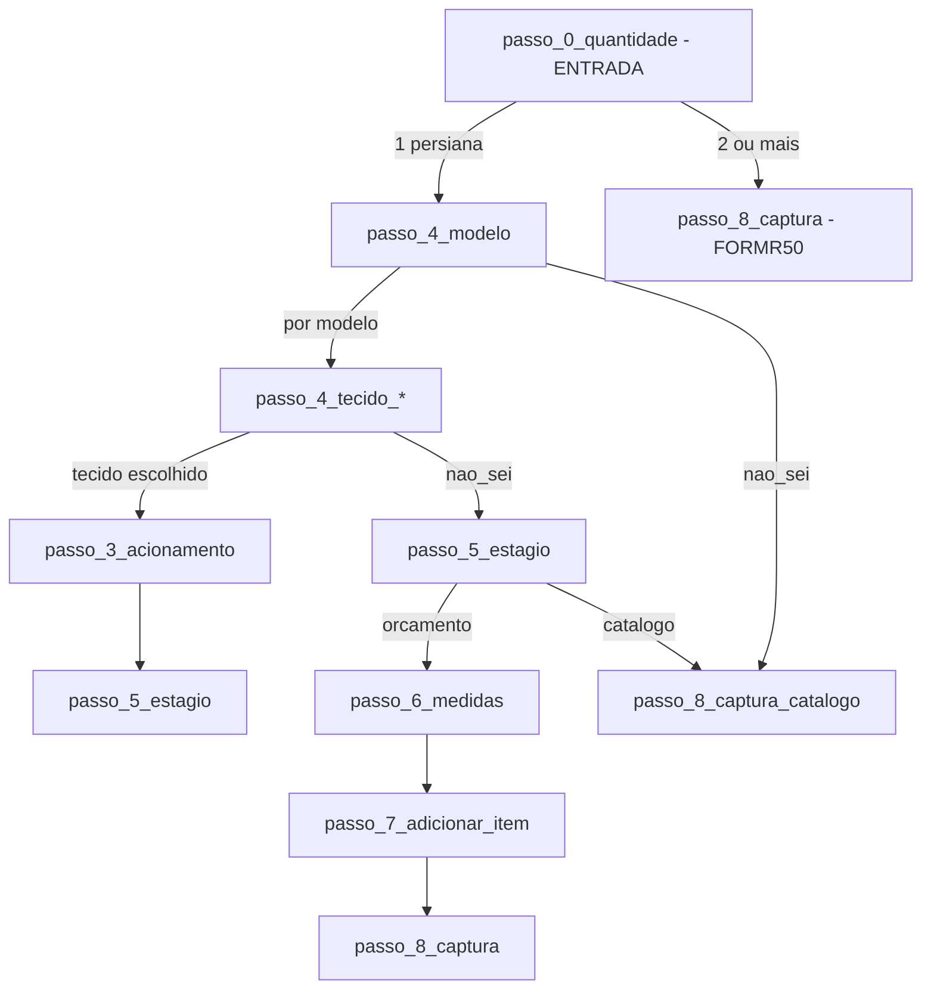

# Quiz V2 — Matriz de etapas e fluxo

Documento de referência para análise e correção do fluxo do Quiz V2.

---

## Ponto de partida

- **Etapa inicial:** `passo_0_quantidade` (após welcome — quantidade de persianas)
- **Fluxo 1 persiana:** `passo_0_quantidade` → `passo_4_modelo` (fluxo completo existente)
- **Fluxo 2+ persianas:** `passo_0_quantidade` → `passo_8_captura` (captura direta, **FORMR50**)
- **Rota:** `/quiz/v2`
- **Webhook (envio final):** `https://n8n.sitespdoze.com.br/webhook/quizv2`
- **A/B:** usa `src/v2/ab_test.js` (variante pode afetar comportamento; steps são os mesmos do array)

---

## Payload do webhook (estrutura)

O body enviado ao webhook é JSON, organizado em blocos únicos (sem repetição). A automação pode usar o bloco **produto** como referência padrão.

| Bloco | Conteúdo |
|-------|----------|
| **metadata** | form_id, quiz_version, source, submitted_at |
| **timestamps** | submitted_at, session_started_at, duration_seconds |
| **utm** | utm_source, utm_medium, utm_campaign, ab_variant, referrer |
| **contact** | nome, whatsapp, email, cidade, bairro, ambientes, ambientes_count |
| **produto** | tipo, modelo, tecido, acabamento, acionamento, medidas (largura, altura, unidade) |
| **quiz_answers** | modelo, tecido, acionamento, medidas, acabamento (espelho de produto) |
| **itens_adicionais** | string única com descrições dos itens adicionais separadas por `;` (ex.: `"Persiana Rolô Blackout 120 x 140; Persiana Double Vision Translúcida 130 x 250"`) |
| **journey** | steps_completed, steps_count |
| **_flat** | Campos planos para integrações (mesmos valores que contact + produto) |

**Regras de produto (automação):**  

- **Persiana de teto:** `produto.modelo` = `romana_teto` \| `celular_teto` \| `plissada_teto`; `produto.tecido` = valor do passo de tecido.  
- **Cortina:** `produto.modelo` = `cortina`; `produto.acabamento` = valor; tecido omitido no bloco principal.  
- Demais modelos: `produto.modelo` e `produto.tecido` conforme escolha.

---

## Formulários (form_id)

**Total: 4 formulários.** O `form_id` é enviado no payload do webhook e usado em tracking (DataLayer, Pixel). (V2 não possui a opção "Já sabe o que quer e quer falar direto com atendente".)

| ID | Valor | Quando é usado |
|----|-------|----------------|
| **FORMR5** | 5 | Não sei - Quero recomendação (catálogo; "Não sei" no modelo/tecido ou não tem medidas) |
| **FORMR20** | 20 | Escolheu uma Persiana (pré-orçamento com medidas, sem itens extras) |
| **FORMR30** | 30 | Escolhe mais de 1 Persiana (pré-orçamento com medidas + itens adicionais) |
| **FORMR50** | 50 | Escolheu "2 ou mais persianas" no início — vai direto para captura final |

---

## Organização dos formulários (V2)

Conforme documento "Organização dos Formulários - Persi.md". Campos técnicos (modelo, tecido, acionamento, largura, altura, outras persianas) só são coletados nas opções de maior valor.

| Opção | Valor | form_id | Campos de contato | Opções coletadas do quiz |
|-------|-------|---------|-------------------|---------------------------|
| 2 ou mais persianas (atalho no início) | 50 | FORMR50 | Nome, Whatsapp, E-mail, Cidade, Bairro, Ambientes | passo_0_quantidade |
| Escolhe mais de 1 Persiana | 30 | FORMR30 | Nome, Whatsapp, E-mail, Cidade, Bairro, Ambientes | Modelo, Tecido, Manual ou Motorizada, Largura, Altura, Outras Persianas / Cortinas |
| Escolheu uma Persiana | 20 | FORMR20 | Nome, Whatsapp, E-mail, Cidade, Bairro, Ambientes | Modelo, Tecido, Manual ou Motorizada, Largura, Altura |
| Não sei - Quero recomendação | 5 | FORMR5 | Nome, Whatsapp, E-mail, Cidade, Bairro, Ambientes | — |

---

## Diferença em relação ao V1

| Aspecto | V1 | V2 |
|---------|----|----|
| Primeira tela | passo_1_intencao (intenção) | passo_4_modelo (modelo) |
| passo_1_intencao no steps | Sim — "ver opções" → passo_4_modelo | Existe no array; "ver opções" → passo_3_acionamento (não usado como entrada) |
| Texto passo_4_modelo | "Perfeito, então vamos começar pela **Primeira Peça.** Qual modelo você prefere?" | "Qual modelo você prefere?" (mais curto) |

---

## Diagrama resumido do fluxo

---

## Regra especial (código)

- Quando o fluxo leva a **`passo_8_captura_catalogo`** (escolheu "Não sei" no modelo, ou modelo+tecido "Não sei", ou no estágio escolheu não ter medidas):
  - `formId` é definido como **FORMR5**

---

## Lista de etapas (mesma estrutura do V1, entrada diferente)

### Fase 1 — Intenção (não usada como tela inicial no V2)

| ID | No V2 | Opções no steps |
|----|-------|------------------|
| **passo_1_intencao** | Não é tela de entrada | Quero ver opções → passo_3_acionamento / Já sei e quero atendente → passo_8_captura |

---

### Fase 3 — Acionamento

| ID | Pergunta | Próximo passo |
|----|----------|----------------|
| **passo_3_acionamento** | Você gostaria dessa persiana manual ou automática? | passo_5_estagio (todas as opções) |

---

### Fase 4 — Modelo (entrada do quiz V2)

| ID | Pergunta | Próximo passo por opção |
|----|----------|--------------------------|
| **passo_4_modelo** | Qual modelo você prefere? | Rolô → passo_4_tecido_rolo / Romana → passo_4_tecido_romana / Double Vision → passo_4_tecido_double / Vertical → passo_4_tecido_vertical / Madeira → passo_4_tecido_madeira / Alumínio → passo_4_tecido_aluminio / Teto → passo_4_modelo_teto / Painel → passo_4_tecido_painel / Cortina → passo_4_tecido_cortina / **Não sei** → passo_8_captura_catalogo |

---

### Fase 4.1 a 4.9 — Tecidos

- **passo_4_tecido_rolo** → passo_3_acionamento (ou "Não sei" → passo_5_estagio)
- **passo_4_tecido_romana** → passo_3_acionamento (ou "Não sei" → passo_5_estagio)
- **passo_4_tecido_double** → passo_3_acionamento (ou "Não sei" → passo_5_estagio)
- **passo_4_tecido_vertical** → passo_5_estagio (todas)
- **passo_4_tecido_madeira** → passo_3_acionamento (ou "Não sei" → passo_5_estagio)
- **passo_4_tecido_aluminio** → passo_3_acionamento (ou "Não sei" → passo_5_estagio)
- **passo_4_modelo_teto** → passo_4_tecido_teto_romana / _celular /_plissada (ou "Não sei" → passo_5_estagio)
- **passo_4_tecido_teto_romana** → passo_3_acionamento (ou "Não sei" → passo_5_estagio)
- **passo_4_tecido_teto_celular** → passo_5_estagio
- **passo_4_tecido_teto_plissada** → passo_5_estagio
- **passo_4_tecido_painel** → passo_5_estagio
- **passo_4_tecido_cortina** → passo_4_acabamento_cortina (ou "Não sei" → passo_5_estagio)
- **passo_4_acabamento_cortina** → passo_3_acionamento (ou "Não sei" → passo_5_estagio)

---

### Fase 5 — Estágio

| ID | Opções | Próximo passo |
|----|--------|----------------|
| **passo_5_estagio** | Já tenho medidas → passo_6_medidas / Não tenho medidas → passo_8_captura_catalogo | passo_6_medidas ou passo_8_captura_catalogo |

---

### Fase 6 — Medidas

| ID | Próximo passo |
|----|----------------|
| **passo_6_medidas** | passo_7_adicionar_item |

---

### Fase 7 — Mais itens / Adicionar item

| ID | Opções | Próximo passo |
|----|--------|----------------|
| **passo_7_adicionar_item** | (textarea ou "Pular") | passo_8_captura |

---

### Fase 8 — Captura (final)

| ID | Uso no V2 |
|----|-----------|
| **passo_8_captura** | Pré-orçamento (nome, whatsapp, email, cidade, bairro, ambientes). isFinal: true |
| **passo_8_captura_catalogo** | Catálogo (nome, whatsapp, email, cidade, bairro, ambientes). isFinal: true. FORMR5. |

---

## Resumo dos destinos finais

- **passo_8_captura** — Pré-orçamento com medidas.
- **passo_8_captura_catalogo** — Catálogo / quem não tem medidas ou escolheu "Não sei" antes do estágio.

---

## Cenários de validação (form_id e campos)

| Cenário | form_id | Tela final | Campos esperados no payload |
|---------|---------|------------|-----------------------------|
| Escolhe "2 ou mais persianas" no início | FORMR50 | passo_8_captura | contact + passo_0_quantidade; produto vazio |
| Escolhe "Não sei" no modelo (ou modelo+tecido "Não sei", ou no estágio "Não tenho medidas") | FORMR5 | passo_8_captura_catalogo | contact: nome, whatsapp, email, cidade, bairro, ambientes; produto vazio ou parcial |
| Escolhe modelo+tecido+acionamento, "Já tenho medidas", preenche medidas, envia (sem adicionar outro) | FORMR20 | passo_8_captura | contact + produto (modelo, tecido, acionamento, medidas); itens_adicionais vazio |
| Idem acima mas escolhe "Adicionar mais um item", descreve e envia | FORMR30 | passo_8_captura | contact + produto + itens_adicionais (string com descrições) |

---

## Arquivos de definição

- Steps: `src/v2/steps.js`
- Lógica de navegação e regras: `src/v2/QuizV2.jsx`
- A/B: `src/v2/ab_test.js`
- Referência: `Organização dos Formulários - Persi.md`
