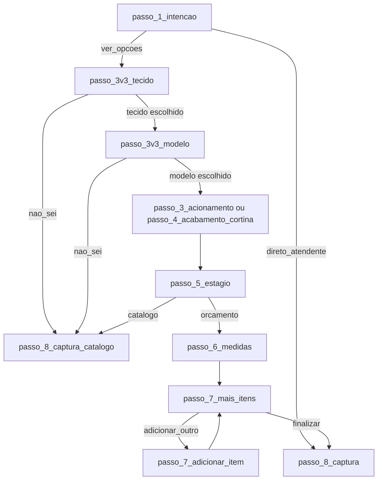

# Quiz V3 — Matriz de etapas e fluxo

Documento de referência para análise e correção do fluxo do Quiz V3. Fluxo **tecido primeiro**, depois modelo.

---

## Ponto de partida

- **Etapa inicial:** `passo_1_intencao`
- **Rota:** `/quiz/v3`
- **Webhook (envio final):** `https://n8n-webhook.axmxa0.easypanel.host/webhook/quizv3`

---

## Formulários (form_id)

**Total: 5 formulários.** O `form_id` é enviado no payload do webhook e usado em tracking (DataLayer, Pixel).

| ID | Quando é usado |
|----|----------------|
| **quizv3** | Valor inicial do quiz |
| **FORMR5** | Catálogo — usuário escolheu "Não sei" (tecido ou modelo) ou não tem medidas |
| **FORMR10** | Já sei o modelo e tecido e tenho as medidas (passo_1_intencao → direto_atendente) |
| **FORMR20** | Uma persiana com medidas (pré-orçamento) |
| **FORMR30** | Mais de uma persiana com medidas (adicionou item extra) |

---

## Diagrama resumido do fluxo

---

## Diferença em relação ao V1 e V2

| Aspecto | V1 / V2 | V3 |
|---------|---------|-----|
| Ordem de escolha | Modelo → Tecido | **Tecido → Modelo** |
| Primeira pergunta (após intenção) | passo_4_modelo (modelo) | passo_3v3_tecido (tecido) |
| Opções de tecido | Por passo (um por modelo) | Lista unificada com "Ver mais" (6 em 6); "Não sei" na última posição |
| Opções de modelo | passo_4_modelo (todas) | passo_3v3_modelo (filtradas pelo tecido escolhido + opção "Não sei") |

---

## Regras especiais (código)

- **passo_3v3_tecido** — Se o usuário escolhe **"Não sei"** (`nao_sei`): vai direto para **passo_8_captura_catalogo** e `formId = FORMR5`.
- **passo_3v3_modelo** — Se o usuário escolhe **"Não sei"**: grava `passo_4_modelo = 'nao_sei'`, vai para **passo_8_captura_catalogo** e `formId = FORMR5`.
- Em qualquer etapa **antes** de `passo_5_estagio`, se o usuário escolher **"Não sei"** em outro passo (ex.: acionamento): vai para **passo_8_captura_catalogo** e `formId = FORMR5`.
- **passo_1_intencao** — "Já sei o modelo e tecido e tenho as medidas" → **passo_8_captura** e `formId = FORMR10`.
- **passo_5_estagio** — "Não tenho medidas" → passo_8_captura_catalogo e `FORMR5`; "Já tenho medidas" → passo_6_medidas e `FORMR20`.
- **passo_7_mais_itens** — "Adicionar outra persiana/cortina" (primeira vez) → `FORMR30`.

---

## Lista de etapas (em ordem de aparição no array)

### Fase 1 — Intenção

| ID | Pergunta | Opções | Próximo passo |
|----|----------|--------|----------------|
| **passo_1_intencao** | Orçamento de Persiana / Cortina | Escolha o tecido que combina com o seu ambiente → **passo_3v3_tecido** / Já sei o modelo e tecido e tenho as medidas → **passo_8_captura** | passo_3v3_tecido ou passo_8_captura |

---

### Fase 4 — Tecido (V3: lista unificada)

| ID | Pergunta | Observação | Próximo passo |
|----|----------|------------|----------------|
| **passo_3v3_tecido** | Qual tecido você prefere? | Lista unificada de tecidos (FABRIC_OPTIONS_UNIFIED). Exibição em grupos de 6 com botão "Ver mais". Opção "Não sei" sempre por último. | Tecido escolhido → passo_3v3_modelo / "Não sei" → passo_8_captura_catalogo |

---

### Fase 4 — Modelo (V3: filtrado pelo tecido)

| ID | Pergunta | Observação | Próximo passo |
|----|----------|------------|----------------|
| **passo_3v3_modelo** | Qual modelo você prefere? | Opções dinâmicas conforme tecido escolhido (TECIDO_TO_MODELS). Inclui opção "Não sei — Quero recomendação" ao final. | Por modelo → passo_3_acionamento (ou passo_4_acabamento_cortina se cortina; ou passo_5_estagio se vertical/painel) / "Não sei" → passo_8_captura_catalogo |

---

### Fase 3 — Acionamento

| ID | Pergunta | Opções | Próximo passo |
|----|----------|--------|----------------|
| **passo_3_acionamento** | Você prefere manual ou automática? | Manual / Motorizada / Ainda não sei | passo_5_estagio (todas) |

---

### Fase 4.9.1 — Acabamento cortina (se modelo = cortina)

| ID | Pergunta | Próximo passo |
|----|----------|----------------|
| **passo_4_acabamento_cortina** | (herdado do V1) | passo_3_acionamento ou passo_5_estagio conforme opção |

---

### Fase 5 — Estágio

| ID | Pergunta | Opções | Próximo passo |
|----|----------|--------|----------------|
| **passo_5_estagio** | Você já tem as medidas? | Sim, já tenho as medidas → **passo_6_medidas** / Não, ainda não tenho as medidas → **passo_8_captura_catalogo** | passo_6_medidas ou passo_8_captura_catalogo |

---

### Fase 6 — Medidas

| ID | Pergunta | Tipo | Próximo passo |
|----|----------|------|----------------|
| **passo_6_medidas** | Envie as medidas necessárias | medidas (largura, altura em cm) | passo_7_mais_itens |

---

### Fase 7 — Mais itens / Adicionar item

| ID | Pergunta | Opções / Ação | Próximo passo |
|----|----------|----------------|----------------|
| **passo_7_mais_itens** | Deseja adicionar mais persianas ou cortinas? | Adicionar outra persiana/cortina → **passo_7_adicionar_item** / Finalizar → **passo_8_captura** | passo_7_adicionar_item ou passo_8_captura |
| **passo_7_adicionar_item** | Informe sobre as próximas persianas e cortinas que deseja | textarea (descrição livre) | passo_7_mais_itens |

---

### Fase 8 — Captura (final)

| ID | Pergunta | Tipo | Observação |
|----|----------|------|------------|
| **passo_8_captura** | Perfeito! Para te enviar este pré-orçamento | mixed: nome, whatsapp, email, cidade, bairro, ambientes (multi-select) | isFinal: true. Payload enviado ao webhook quizv3. |
| **passo_8_captura_catalogo** | Receber Catálogo | mixed: nome, whatsapp, ambientes | isFinal: true. Payload enviado ao webhook quizv3. |

---

## Resumo dos destinos finais

- **passo_8_captura** — Pré-orçamento com medidas (fluxo completo ou direto_atendente).
- **passo_8_captura_catalogo** — Catálogo (quem não tem medidas ou escolheu "Não sei" em tecido ou modelo).

---

## Arquivos de definição

- Steps: `src/v3/steps.js`
- Dados de tecidos e modelo (lista unificada, mapa tecido→modelo): `src/v3/stepsData.js`
- Lógica de navegação e regras: `src/v3/QuizV3.jsx`
- Componente de pergunta (comportamento "Ver mais" tecidos): `src/components/StepQuestionV1.jsx` (prop `tecidoExpandableLimit = 6`)
