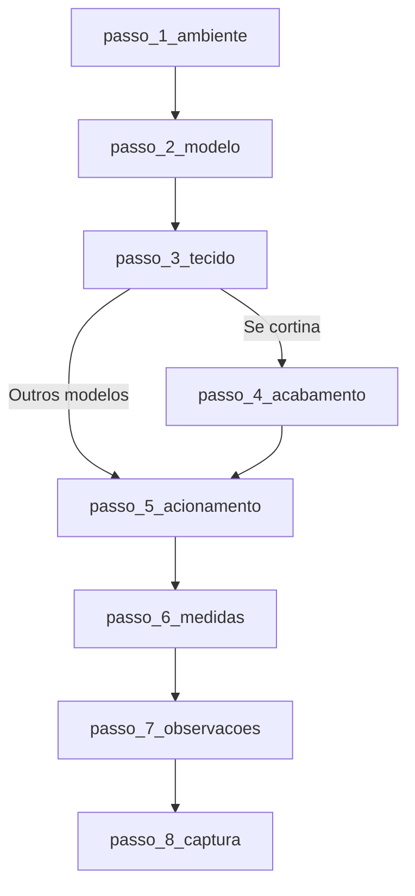

# Quiz V4 — Matriz de etapas e fluxo

Documento de referência para análise e fluxo do Quiz V4. Quiz de recomendação por ambiente.

---

## Ponto de partida

- **Etapa inicial:** `passo_1_ambiente`
- **Rota:** `/quiz/v4`
- **Webhook:** `VITE_WEBHOOK_QUIZ_V4_URL`

---

## Formulários (form_id)

**Total: 1 formulário.**

| ID | Quando é usado |
|----|----------------|
| **FORMR20** | Usado em todos os envios de pré-orçamento (valor padrão no código). Não há desvio para catálogo ou contato direto no fluxo V4. |

---

## Diagrama resumido do fluxo

*(Nota: O passo_5_acionamento não é exibido para os modelos "vertical" e "painel")*

---

## Lista de etapas

| Fase | ID | Pergunta | Próximo passo |
|------|----|----------|----------------|
| 1 | **passo_1_ambiente** | Para qual ambiente você está buscando sua Cortina/Persiana? | passo_2_modelo |
| 2 | **passo_2_modelo** | Escolha o modelo ideal para você: | passo_3_tecido |
| 3 | **passo_3_tecido** | Escolha o tecido: | Cortina -> passo_4_acabamento / Outros -> passo_5_acionamento |
| 4 | **passo_4_acabamento** | Escolha o acabamento: (Apenas cortina) | passo_5_acionamento |
| 5 | **passo_5_acionamento** | Como você prefere o acionamento? | passo_6_medidas |
| 6 | **passo_6_medidas** | Informe as medidas da sua janela/porta: | passo_7_observacoes |
| 7 | **passo_7_observacoes** | Observações ou Outras Persianas/Cortinas para orçar: | passo_8_captura |
| 8 | **passo_8_captura** | Perfeito! Para te enviar este pré-orçamento... | isFinal: true |

---

## Arquivos de definição

- Steps: `src/v4/steps.js`
- Lógica de navegação: `src/v4/QuizV4.jsx`
- Dados de recomendação: `src/data/ambienteQuizData.js`
