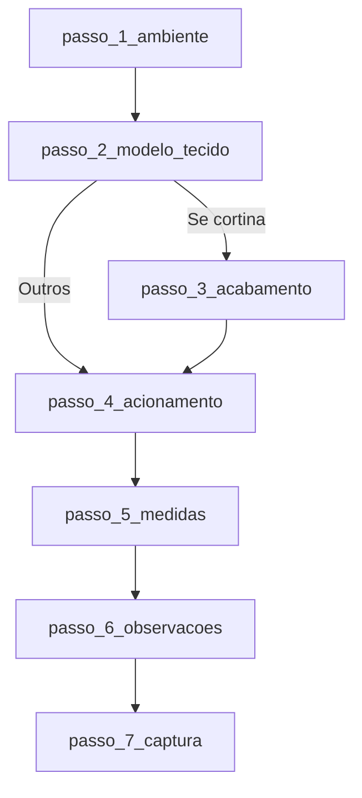

# Quiz V6 — Matriz de etapas e fluxo

Documento de referência para análise e fluxo do Quiz V6. A escolha de **Modelo e Tecido** ocorre na mesma etapa (combinada).

---

## Ponto de partida

- **Etapa inicial:** `passo_1_ambiente`
- **Rota:** `/quiz/v6`
- **Webhook:** `VITE_WEBHOOK_QUIZ_V6_URL`

---

## Formulários (form_id)

**Total: 1 formulário.**

| ID | Quando é usado |
|----|----------------|
| **FORMR20** | Padrão para todos os envios de orçamento neste fluxo encurtado. |

---

## Diagrama resumido do fluxo

---

## Lista de etapas

| Fase | ID | Pergunta | Próximo passo |
|------|----|----------|----------------|
| 1 | **passo_1_ambiente** | Para qual ambiente você está buscando...? | passo_2_modelo_tecido |
| 2 | **passo_2_modelo_tecido** | Escolha o modelo e tecido ideal para você: | Cortina -> passo_3_acabamento / Outros -> passo_4_acionamento |
| 3 | **passo_3_acabamento** | Escolha o acabamento: (Apenas cortina) | passo_4_acionamento |
| 4 | **passo_4_acionamento** | Como você prefere o acionamento? | passo_5_medidas |
| 5 | **passo_5_medidas** | Informe as medidas... | passo_6_observacoes |
| 6 | **passo_6_observacoes** | Observações ou outros ambientes para orçar: | passo_7_captura |
| 7 | **passo_7_captura** | Perfeito! Para te enviar este pré-orçamento... | isFinal: true |

---

## Arquivos de definição

- Steps: `src/v6/steps.js`
- Lógica de navegação: `src/v6/QuizV6.jsx`
- Combinações e Regras: `getCombinacoesModeloTecido` em `src/data/ambienteQuizData.js`
